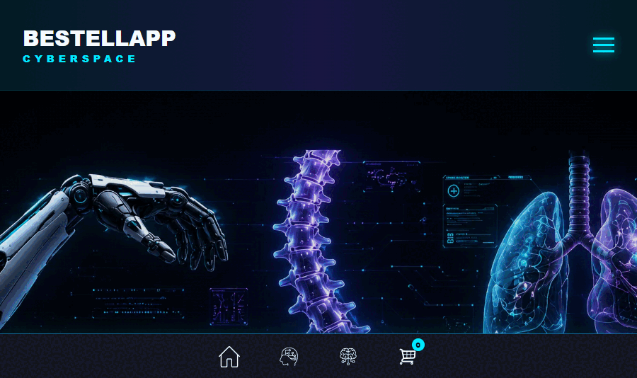
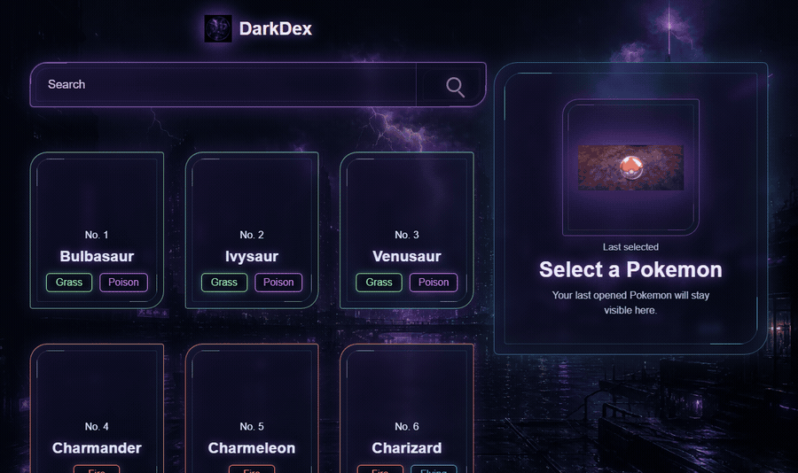
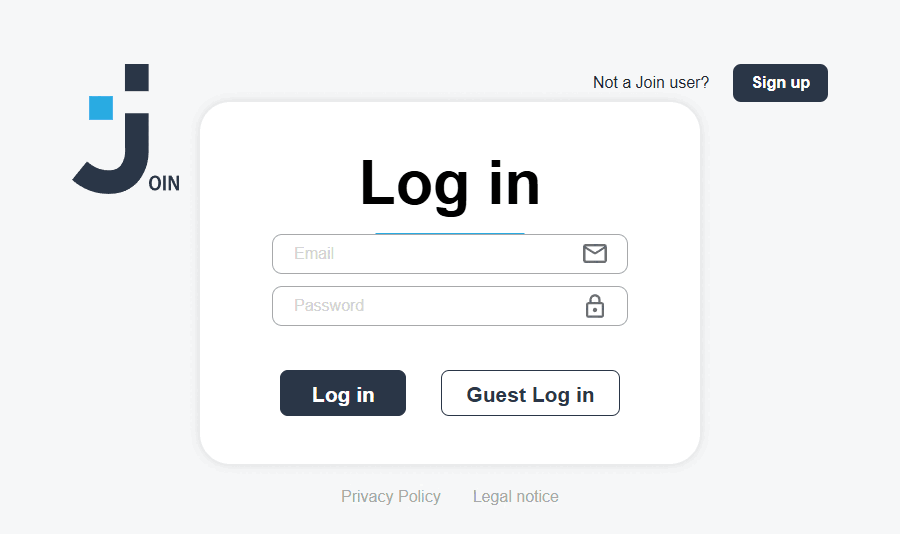

  

<!-- Header -->
#  ɪ'ᴍ ANDRE! 

**Aspiring Full-Stack Developer · JavaScript · Firebase · DevOps & Cybersecurity Enthusiast**

<!-- Introduction -->

  I'm an aspiring full-stack developer with a growing interest in cybersecurity, DevOps and AI.
  I enjoy solving new challenges, building practical applications and continuously improving my skills.

- 💯 Determined to turn ideas into reliable applications.
- 🌱 Learning every day through hands-on projects and continuous practice.
- 🎓 Student at [Developer Akademie](https://developerakademie.com/).

---

<!-- Languages and Tools -->
<h2 align="center">Tᴇᴄʜ Sᴛᴀᴄᴋ</h2>

  
  
  
  
  
  
  
  
  
  
  
  
  

HTML · CSS · JavaScript · REST APIs · Git · GitHub · Firebase · VS Code

<h2 align="center">Cᴜʀʀᴇɴᴛ Lᴇᴀʀɴɪɴɢ</h2>

<ul align="left">
  <li>Deepening my JavaScript and full-stack development skills.</li>
  <li>Exploring machine learning, AI, cybersecurity and DevOps fundamentals.</li>
  <li>Improving code quality, testing, accessibility and responsive design through practical projects.</li>
</ul>

---

<h2 align="center">Fᴇᴀᴛᴜʀᴇᴅ Pʀᴏᴊᴇᴄᴛs</h2>

<table>
  <tr>
    <th width="33%">BestellApp</th>
    <th width="33%">DarkDex Pokédex</th>
    <th width="33%">Join 360</th>
  </tr>
  <tr>
    <td align="center"><a href="https://andrewojak1618-debug.github.io/BestellApp-Dev-Test/"><strong>Open Live Demo</strong></a></td>
    <td align="center"><a href="https://andrewojak1618-debug.github.io/Pok-dex_newera/"><strong>Open Live Demo</strong></a></td>
    <td align="center"><a href="https://join-teamjob.web.app/"><strong>Open Live Demo</strong></a></td>
  </tr>
  <tr>
    <td align="center"></td>
    <td align="center"></td>
    <td align="center"></td>
  </tr>
  <tr>
    <td align="center"><a href="https://github.com/andrewojak1618-debug/BestellApp-Dev-Test">View Repository</a></td>
    <td align="center"><a href="https://github.com/andrewojak1618-debug/Pok-dex_newera">View Repository</a></td>
    <td align="center"><a href="https://github.com/andrewojak1618-debug/Join">View Repository</a></td>
  </tr>
</table>

---

<!-- Coding mindset -->
<h2 align="center">💡 Cᴏᴅɪɴɢ Mɪɴᴅsᴇᴛ 💡</h2>

  

---

<!-- Contact -->
<h2 align="center">🤝 Cᴏɴɴᴇᴄᴛ Wɪᴛʜ Mᴇ 🤝</h2>

  
  &nbsp;&nbsp;
  
  &nbsp;&nbsp;
  

---

<h2 align="center">Cᴏɴᴛʀɪʙᴜᴛɪᴏɴ Aᴄᴛɪᴠɪᴛʏ</h2>

